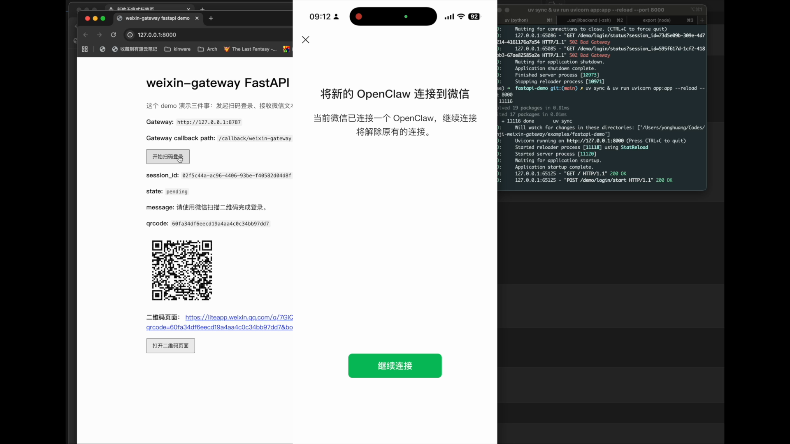

# Weixin Gateway

[](https://www.npmjs.com/package/@bryanhuang7878/weixin-gateway)

一个独立的微信网关，可对接任意上游 Agent 服务。

- [License](./LICENSE)
- [Contributing](./CONTRIBUTING.md)
- [Changelog](./CHANGELOG.md)
- [Release Checklist](./RELEASE_CHECKLIST.md)
- [Repo Split Guide](./REPO_SPLIT_GUIDE.md)
- [Publishing Notes](./PUBLISHING.md)
- [FastAPI Demo](./examples/fastapi-demo/README.md)

## npm

已发布到 npm：

- `@bryanhuang7878/weixin-gateway`

安装：

```bash
npm install -g @bryanhuang7878/weixin-gateway
```

安装后可直接使用：

```bash
weixin-gateway health
weixin-gateway login:start
```

## Demo

[](https://youtu.be/kmpNYUXBEZo)

- 点击封面图可查看演示视频
- 当前视频展示的是：
  - 扫码登录
  - FastAPI demo 接收微信文本
  - 文本回声回复到微信

## 适合什么场景

你可以把它当成一个独立服务来用：

- 管理微信 Bot 登录
- 持续拉取微信消息
- 把消息转发给你的 Agent 服务
- 把 Agent 的回复发回微信

当前已支持：

- 文本
- 图片
- 视频
- 语音
- 文件
- 二维码登录
- 自动轮询
- 账号管理
- API / CLI
- 两种上游投递模式：
  - `callback`
  - `inbox`
- 失效账号状态标记（`expired`）

## 最小上游示例

如果你想最快看懂“上游应该怎么接”，可以直接看：

- [examples/fastapi-demo](./examples/fastapi-demo/README.md)

这个 demo 只实现：

- 扫码登录
- 接收微信文本
- 文本回声回复

## 1 分钟上手

### 1. 启动服务

如果你已经全局安装了 npm 包：

```bash
weixin-gateway
```

如果你是在仓库源码里本地开发：

```bash
cd /Users/yonghuang/Codes/xuanji-weixin-gateway
node src/server.js
```

默认监听：

- `http://127.0.0.1:8787`

### 2. 登录微信账号

**CLI**

```bash
weixin-gateway login:start
```

会输出：

- `session_id`
- `qrcode`
- `qrcode_url`

扫码后盯状态：

```bash
weixin-gateway login:watch --session-id <session_id>
```

登录成功后可查看账号：

```bash
weixin-gateway accounts
```

**API**

创建二维码登录会话：

```http
POST /login/qr/start
Content-Type: application/json
```

```json
{
  "account_id": "wx-account-1",
  "api_base_url": "https://ilinkai.weixin.qq.com"
}
```

返回结果里会包含：

- `session_id`
- `qrcode`
- `qrcode_url`

然后轮询状态：

```http
GET /login/qr/status?session_id=<session_id>
```

直到状态变成：

- `completed`

登录成功后可通过：

```http
GET /accounts
```

确认账号是否已经写入。

### 3. 自动轮询

默认行为：

- 服务启动后，如果本地已经有账号，会自动开始轮询
- 新账号登录成功后，也会自动开始轮询

**CLI**

查看轮询状态：

```bash
weixin-gateway poll:status
```

手动启动或停止：

```bash
weixin-gateway poll:start
weixin-gateway poll:stop
```

**API**

查看轮询状态：

```http
GET /poll/status
```

手动启动或停止：

```http
POST /poll/start
POST /poll/stop
```

### 4. 对接你的上游 Agent

从 `v0.2.0` 开始，gateway 支持两种上游投递模式：

- `callback`
  - 保持原有行为
  - 微信消息到达后直接回调你的上游 HTTP 服务
- `inbox`
  - 不主动回调
  - 把消息存进 gateway inbox，等待你的 Agent 主动拉取

默认模式仍然是：

- `callback`

账号状态说明：

- `active`
  - 当前账号仍会参与自动轮询
- `expired`
  - 该账号在轮询中出现过 `session timeout`
  - 记录会保留，但自动轮询会默认跳过它

如果你准备让 Codex 或其他本地 agent 主动轮询处理消息，推荐设置：

```bash
export WEIXIN_GATEWAY_DELIVERY_MODE=inbox
```

需要配置上游服务地址：

```bash
export UPSTREAM_BASE_URL=http://127.0.0.1:8000
export UPSTREAM_EVENTS_PATH=/callback/weixin-gateway
```

Gateway 会把入站微信消息转发到：

- `UPSTREAM_BASE_URL + UPSTREAM_EVENTS_PATH`

例如：

- `http://127.0.0.1:8000/callback/weixin-gateway`

在 `inbox` 模式下，这组 `UPSTREAM_*` 配置不是必需的；消息会保存在 gateway 本地 inbox，等待你的 agent 通过 API 或 CLI 拉取。

你的上游服务需要做两件事：

1. 提供一个接收微信入站事件的 HTTP 接口
2. 在处理完成后，调用 gateway 的 `/send` 把回复发回微信

最小闭环就是：

微信 -> gateway -> 你的 Agent -> gateway -> 微信

**CLI**

这一段通常不通过 CLI 对接，而是：

- 用环境变量指定上游地址
- 让 gateway 自动把微信消息推给你的上游服务

**API**

需要配置：

```bash
export UPSTREAM_BASE_URL=http://127.0.0.1:8000
export UPSTREAM_EVENTS_PATH=/callback/weixin-gateway
```

这样 gateway 会把入站事件发到：

- `http://127.0.0.1:8000/callback/weixin-gateway`

#### 上游 callback 要怎么实现

你的上游服务需要提供一个 `POST` 接口，例如：

- `POST /callback/weixin-gateway`

gateway 会把微信消息以 JSON 形式发给这个接口。

#### Request schema

请求头：

```http
Content-Type: application/json
Authorization: Bearer <UPSTREAM_SHARED_SECRET>
```

如果没有配置 `UPSTREAM_SHARED_SECRET`，则不会带 `Authorization`。

请求体结构：

```json
{
  "type": "message",
  "account_id": "wx-account-1",
  "event_id": "evt-1",
  "chat_id": "wx-user-1",
  "user_id": "wx-user-1",
  "text": "你好",
  "context_token": "ctx-1",
  "chat_type": "c2c",
  "raw": {}
}
```

字段说明：

- `type: string`
  - 当前固定为 `message`
- `account_id: string`
  - 当前使用的微信 Bot 账号 ID
- `event_id: string`
  - 当前消息事件 ID，可用于去重
- `chat_id: string`
  - 当前会话对端 ID
- `user_id: string`
  - 当前用户 ID
- `text: string`
  - gateway 转换后的文本内容
- `context_token: string`
  - 回消息时建议原样带回
- `chat_type: string`
  - 当前阶段固定为 `c2c`
- `raw: object`
  - 原始微信消息对象

当前 `raw` 里可能还会带：

- `item_list`
- `message_type`
- `message_id`
- `create_time_ms`

你的上游服务收到后，至少需要：

- 读取 `account_id`
- 读取 `user_id` 或 `chat_id`
- 读取 `text`
- 保留 `context_token`

然后生成回复。

#### 上游如何接收入站图片、文件、视频、语音

**CLI**

这一部分通常不通过 CLI 处理。  
入站附件会随着 callback 事件一起推给你的上游服务。

**API**

当用户从微信发送附件时，gateway 会先把附件下载到本地，再转发事件给上游。

上游收到的事件里：

- `text` 会包含附件提示
- 事件对象里会带 `attachments`

示例：

```json
{
  "type": "message",
  "account_id": "wx-account-1",
  "event_id": "evt-1",
  "chat_id": "wx-user-1",
  "user_id": "wx-user-1",
  "text": "用户发送了以下附件：\n- image: /path/to/image.png",
  "context_token": "ctx-1",
  "chat_type": "c2c",
  "attachments": [
    {
      "kind": "image",
      "path": "/Users/you/weixin-gateway/.data/inbound/weixin-inbound-1.png",
      "filename": "weixin-inbound-1.png",
      "mime_type": "image/png"
    }
  ],
  "raw": {}
}
```

`attachments` 当前可能出现的 `kind`：

- `image`
- `video`
- `voice`
- `file`

建议上游这样处理：

- 对图片：读取本地文件路径，交给 vision / multimodal 能力
- 对视频：读取本地文件路径，交给视频分析链路
- 对语音：读取本地文件路径，交给语音转写或音频理解链路
- 对文件：读取本地文件路径，按文档或通用文件处理

当前入站附件默认落盘到：

- `WEIXIN_GATEWAY_DATA_DIR/inbound`

如果未设置 `WEIXIN_GATEWAY_DATA_DIR`，默认是：

- `./.data/inbound`

#### Response schema

最小要求：

- 返回任意 `2xx` 状态码即可

最简单可以是：

```http
HTTP/1.1 200 OK
Content-Type: application/json
```

```json
{
  "ok": true
}
```

也可以直接返回空响应体。

注意：

- gateway **不会**读取这个响应体里的消息内容
- 这个 callback 的职责只是“接收事件”
- 真正发回微信，请单独调用 gateway 的 `POST /send`

#### 上游怎么把回复发回微信

**CLI**

如果只是手工调试，你可以直接调用 gateway 的 HTTP API。

**API**

你的上游服务生成回复后，需要调用 gateway 的：

- `POST /send`

例如 gateway 跑在本机默认端口：

- `http://127.0.0.1:8787/send`

文本回复示例：

```json
{
  "account_id": "wx-account-1",
  "to_user_id": "wx-user-1",
  "context_token": "ctx-1",
  "chat_type": "c2c",
  "items": [
    {
      "type": "text",
      "text": "你好，我收到了。"
    }
  ]
}
```

这里最重要的是：

- `account_id` 用入站事件里的 `account_id`
- `to_user_id` 用入站事件里的 `user_id` 或 `chat_id`
- `context_token` 尽量原样带回

如果你想发图片、视频、语音或文件，也同样走 `/send`。

#### `/send` request schema

**CLI**

当前没有单独的 `send` CLI 命令。  
推荐方式是让你的上游服务直接调用 `POST /send`。

**API**

请求头：

```http
Content-Type: application/json
```

请求体结构：

```json
{
  "account_id": "wx-account-1",
  "to_user_id": "wx-user-1",
  "context_token": "ctx-1",
  "chat_type": "c2c",
  "items": []
}
```

字段说明：

- `account_id: string`
  - 要使用哪个微信 Bot 账号发消息
- `to_user_id: string`
  - 目标微信用户 ID
- `context_token: string`
  - 建议从入站事件原样带回
- `chat_type: string`
  - 当前建议固定为 `c2c`
- `items: array`
  - 要发送的消息内容

#### `/send` 文本消息

```json
{
  "account_id": "wx-account-1",
  "to_user_id": "wx-user-1",
  "context_token": "ctx-1",
  "chat_type": "c2c",
  "items": [
    {
      "type": "text",
      "text": "你好，我收到了。"
    }
  ]
}
```

#### `/send` 图片消息

```json
{
  "account_id": "wx-account-1",
  "to_user_id": "wx-user-1",
  "context_token": "ctx-1",
  "chat_type": "c2c",
  "items": [
    {
      "type": "file",
      "file_type": 1,
      "url": "https://example.com/image.png"
    }
  ]
}
```

#### `/send` 视频消息

```json
{
  "account_id": "wx-account-1",
  "to_user_id": "wx-user-1",
  "context_token": "ctx-1",
  "chat_type": "c2c",
  "items": [
    {
      "type": "file",
      "file_type": 2,
      "url": "https://example.com/video.mp4"
    }
  ]
}
```

#### `/send` 语音消息

```json
{
  "account_id": "wx-account-1",
  "to_user_id": "wx-user-1",
  "context_token": "ctx-1",
  "chat_type": "c2c",
  "items": [
    {
      "type": "file",
      "file_type": 3,
      "url": "https://example.com/voice.mp3"
    }
  ]
}
```

#### `/send` 文件消息

```json
{
  "account_id": "wx-account-1",
  "to_user_id": "wx-user-1",
  "context_token": "ctx-1",
  "chat_type": "c2c",
  "items": [
    {
      "type": "file",
      "file_type": 4,
      "url": "https://example.com/report.pdf"
    }
  ]
}
```

`file_type` 约定：

- `1` 图片
- `2` 视频
- `3` 语音
- `4` 文件

语音当前支持的上传格式：

- `.mp3`
- `.silk`
- `.amr`
- `.ogg`

媒体和文件发送约定：

- `url` 支持三种形式：
  - `https://...`
  - `http://...`
  - `file:///absolute/path/to/file`
  - `/absolute/path/to/file`
- 只要 gateway 进程自己能读到这个文件即可
- 对 `http(s)`，gateway 会先下载文件
- 对 `file://` 或绝对路径，gateway 会直接读取本地文件
- gateway 会把文件转成微信可发送的媒体
- 如果是大文件或视频，微信端可能会有短暂延迟后才显示

## 推荐使用流程

### 用 CLI

适合本地调试、单机运行、运维排障。

常用命令：

```bash
weixin-gateway health
weixin-gateway accounts
weixin-gateway accounts:show --account-id <account_id>
weixin-gateway accounts:remove --account-id <account_id>
weixin-gateway login:start
weixin-gateway login:status --session-id <session_id>
weixin-gateway login:watch --session-id <session_id>
weixin-gateway login:cancel --session-id <session_id>
weixin-gateway poll:status
weixin-gateway poll:start
weixin-gateway poll:stop
weixin-gateway inbox:list --status pending
weixin-gateway inbox:claim --message-id <message_id> --worker-id codex
weixin-gateway inbox:complete --message-id <message_id>
weixin-gateway inbox:fail --message-id <message_id> --error "..."
weixin-gateway typing:send --account-id <account_id> --to-user-id <user_id>
weixin-gateway typing:cancel --account-id <account_id> --to-user-id <user_id>
```

### 用 API

适合接入其他 Agent、平台或自定义服务。

基础地址默认是：

- `http://127.0.0.1:8787`

## API 概览

### `GET /health`

**Request**

- 无请求体

**Response**

```json
{
  "ok": true,
  "service": "weixin-gateway",
  "phase": "text-mvp",
  "delivery_mode": "callback",
  "polling": {
    "running": true,
    "interval_ms": 5000
  }
}
```

### `GET /accounts`

**Request**

- 无请求体

**Response**

```json
{
  "ok": true,
  "accounts": [
    {
      "account_id": "wx-account-1",
      "api_base_url": "https://ilinkai.weixin.qq.com",
      "wechat_uin": "user@im.wechat",
      "cursor": "",
      "created_at": "2026-03-24T00:00:00.000Z",
      "updated_at": "2026-03-24T00:00:00.000Z",
      "status": {
        "session_state": "active",
        "polling_running": true,
        "has_cursor": false,
        "last_forwarded": 0,
        "last_error": "",
        "last_cursor": "",
        "last_poll_finished_at": ""
      }
    }
  ]
}
```

### `GET /accounts/:account_id`

**Request**

- 路径参数：`account_id`

**Response**

```json
{
  "ok": true,
  "account": {
    "account_id": "wx-account-1",
    "api_base_url": "https://ilinkai.weixin.qq.com",
    "wechat_uin": "user@im.wechat",
    "cursor": "",
    "created_at": "2026-03-24T00:00:00.000Z",
    "updated_at": "2026-03-24T00:00:00.000Z",
    "status": {
      "session_state": "active",
      "polling_running": true,
      "has_cursor": false,
      "last_forwarded": 0,
      "last_error": "",
      "last_cursor": "",
      "last_poll_finished_at": ""
    }
  }
}
```

找不到账号时：

```json
{
  "ok": false,
  "error": "unknown account_id"
}
```

### `POST /accounts/register`

用于手工注册账号。

**Request**

```json
{
  "account_id": "wx-account-1",
  "api_base_url": "https://ilinkai.weixin.qq.com",
  "bot_token": "token-from-login",
  "wechat_uin": "user@im.wechat"
}
```

**Response**

```json
{
  "ok": true,
  "account": {
    "account_id": "wx-account-1",
    "api_base_url": "https://ilinkai.weixin.qq.com",
    "wechat_uin": "user@im.wechat",
    "cursor": "",
    "created_at": "2026-03-24T00:00:00.000Z",
    "updated_at": "2026-03-24T00:00:00.000Z",
    "status": {
      "polling_running": true,
      "has_cursor": false,
      "last_forwarded": 0,
      "last_error": "",
      "last_cursor": "",
      "last_poll_finished_at": ""
    }
  }
}
```

缺少字段时：

```json
{
  "ok": false,
  "error": "account_id, api_base_url, bot_token, wechat_uin are required"
}
```

### `DELETE /accounts/:account_id`

**Request**

- 路径参数：`account_id`

**Response**

```json
{
  "ok": true,
  "removed": {
    "account_id": "wx-account-1",
    "api_base_url": "https://ilinkai.weixin.qq.com",
    "wechat_uin": "user@im.wechat",
    "cursor": "",
    "created_at": "2026-03-24T00:00:00.000Z",
    "updated_at": "2026-03-24T00:00:00.000Z",
    "status": {
      "session_state": "active",
      "polling_running": false,
      "has_cursor": false,
      "last_forwarded": 0,
      "last_error": "",
      "last_cursor": "",
      "last_poll_finished_at": ""
    }
  },
  "polling": {
    "running": false
  }
}
```

### `POST /login/qr/start`

**Request**

```json
{
  "account_id": "wx-account-1",
  "api_base_url": "https://ilinkai.weixin.qq.com"
}
```

`account_id` 可选；不传时 gateway 会生成一个临时账号 ID。

**Response**

```json
{
  "ok": true,
  "session": {
    "session_id": "sess-1",
    "account_id": "wx-account-1",
    "state": "pending",
    "qrcode": "qr-123",
    "qrcode_url": "https://example.com/qr.png"
  }
}
```

### `GET /login/qr/status?session_id=...`

**Request**

- 查询参数：`session_id`

**Response**

```json
{
  "ok": true,
  "session": {
    "session_id": "sess-1",
    "account_id": "wx-account-1",
    "state": "completed",
    "message": "微信登录成功。"
  }
}
```

状态值包括：

- `pending`
- `scaned`
- `completed`
- `expired`
- `cancelled`

缺少 `session_id` 时：

```json
{
  "ok": false,
  "error": "session_id is required"
}
```

### `POST /login/qr/cancel`

**Request**

```json
{
  "session_id": "sess-1"
}
```

**Response**

```json
{
  "ok": true,
  "session": {
    "session_id": "sess-1",
    "state": "cancelled"
  }
}
```

### `POST /login/qr/complete`

用于手工补录一次登录结果。大多数场景不需要它；通常只在调试或特殊登录流程里使用。

**Request**

```json
{
  "session_id": "sess-1",
  "api_base_url": "https://ilinkai.weixin.qq.com",
  "bot_token": "token-from-login",
  "wechat_uin": "user@im.wechat"
}
```

**Response**

```json
{
  "ok": true,
  "session": {
    "session_id": "sess-1",
    "state": "completed"
  },
  "account": {
    "account_id": "wx-account-1",
    "api_base_url": "https://ilinkai.weixin.qq.com",
    "wechat_uin": "user@im.wechat",
    "cursor": ""
  }
}
```

### `GET /poll/status`

**Request**

- 无请求体

**Response**

```json
{
  "ok": true,
  "delivery_mode": "callback",
  "polling": {
    "running": true,
    "interval_ms": 5000,
    "last_started_at": "2026-03-24T00:00:00.000Z",
    "last_finished_at": "2026-03-24T00:00:01.000Z",
    "last_error": "",
    "last_results": []
  }
}
```

### `POST /poll/start`

**Request**

- 空 JSON 或无请求体均可

**Response**

```json
{
  "ok": true,
  "polling": {
    "running": true,
    "interval_ms": 5000
  }
}
```

### `POST /poll/stop`

**Request**

- 空 JSON 或无请求体均可

**Response**

```json
{
  "ok": true,
  "polling": {
    "running": false,
    "interval_ms": 5000
  }
}
```

### `POST /poll/run-once`

**Request**

- 空 JSON 或无请求体均可

**Response**

```json
{
  "ok": true,
  "delivery_mode": "callback",
  "results": [
    {
      "account_id": "wx-account-1",
      "forwarded": 1,
      "cursor": "next-cursor"
    }
  ]
}
```

### `GET /inbox/messages`

用于拉取 gateway 已暂存的入站消息。适合本地 agent、Codex automation 或任何不想开 webhook server 的上游。

**CLI**

```bash
weixin-gateway inbox:list --status pending --limit 10
```

**Request**

- 查询参数：
  - `status`，默认 `pending`
  - `limit`，默认 `20`
  - `account_id`，可选

**Response**

```json
{
  "ok": true,
  "messages": [
    {
      "id": "msg-1",
      "type": "message",
      "status": "pending",
      "account_id": "wx-account-1",
      "event_id": "evt-1",
      "chat_id": "wx-user-1",
      "user_id": "wx-user-1",
      "chat_type": "c2c",
      "text": "帮我看一下仓库状态",
      "context_token": "ctx-1",
      "attachments": [],
      "callback_attempted": false,
      "callback_succeeded": false,
      "claim": null,
      "error": "",
      "created_at": "2026-03-24T00:00:00.000Z",
      "updated_at": "2026-03-24T00:00:00.000Z"
    }
  ]
}
```

### `GET /inbox/messages/:message_id`

**CLI**

```bash
weixin-gateway inbox:show --message-id msg-1
```

**Response**

```json
{
  "ok": true,
  "message": {
    "id": "msg-1",
    "status": "pending",
    "account_id": "wx-account-1",
    "user_id": "wx-user-1",
    "text": "帮我看一下仓库状态"
  }
}
```

### `POST /inbox/messages/:message_id/claim`

claim 用于告诉 gateway：这条消息已经被某个 worker 接手，避免被重复消费。

**CLI**

```bash
weixin-gateway inbox:claim --message-id msg-1 --worker-id codex
```

**Request**

```json
{
  "worker_id": "codex"
}
```

**Response**

```json
{
  "ok": true,
  "message": {
    "id": "msg-1",
    "status": "claimed",
    "claim": {
      "worker_id": "codex",
      "claimed_at": "2026-03-24T00:00:05.000Z"
    }
  }
}
```

### `POST /inbox/messages/:message_id/complete`

**CLI**

```bash
weixin-gateway inbox:complete --message-id msg-1 --completion-note "reply sent"
```

**Request**

```json
{
  "completion_note": "reply sent"
}
```

**Response**

```json
{
  "ok": true,
  "message": {
    "id": "msg-1",
    "status": "completed",
    "completed_at": "2026-03-24T00:00:30.000Z"
  }
}
```

### `POST /inbox/messages/:message_id/fail`

**CLI**

```bash
weixin-gateway inbox:fail --message-id msg-1 --error "temporary failure"
```

**Request**

```json
{
  "error": "temporary failure"
}
```

**Response**

```json
{
  "ok": true,
  "message": {
    "id": "msg-1",
    "status": "failed",
    "error": "temporary failure",
    "failed_at": "2026-03-24T00:00:30.000Z"
  }
}
```

### `POST /accounts/:account_id/poll-once`

**Request**

- 路径参数：`account_id`

**Response**

```json
{
  "ok": true,
  "result": {
    "account_id": "wx-account-1",
    "forwarded": 1,
    "cursor": "next-cursor"
  }
}
```

找不到账号时：

```json
{
  "ok": false,
  "error": "unknown account_id"
}
```

### `POST /typing`

**CLI**

```bash
weixin-gateway typing:send --account-id <account_id> --to-user-id <user_id>
weixin-gateway typing:cancel --account-id <account_id> --to-user-id <user_id>
```

**API**

**Request**

```json
{
  "account_id": "wx-account-1",
  "to_user_id": "wx-user-1",
  "context_token": "ctx-123",
  "status": "typing"
}
```

`status` 支持：

- `typing`
- `cancel`

**Response**

```json
{
  "ok": true,
  "typing": {
    "account_id": "wx-account-1",
    "to_user_id": "wx-user-1",
    "status": "typing"
  }
}
```

### `POST /send`

支持：

- 文本
- 图片
- 视频
- 语音
- 文件

**Request**

```json
{
  "account_id": "wx-account-1",
  "to_user_id": "wx-user-1",
  "context_token": "ctx-123",
  "chat_type": "c2c",
  "items": []
}
```

顶层字段：

- `account_id: string`
  - 用哪个微信 Bot 账号发送
- `to_user_id: string`
  - 发给哪个微信用户
- `context_token: string`
  - 建议从入站事件原样带回
- `chat_type: string`
  - 当前建议固定为 `c2c`
- `items: array`
  - 实际要发送的消息内容

`items` 目前支持两类：

### `items[].type = "text"`

```json
{
  "type": "text",
  "text": "你好"
}
```

字段：

- `type: "text"`
- `text: string`

### `items[].type = "file"`

```json
{
  "type": "file",
  "file_type": 1,
  "url": "https://example.com/image.png"
}
```

字段：

- `type: "file"`
- `file_type: number`
- `url: string`

`url` 支持：

- `https://...`
- `http://...`
- `file:///absolute/path/to/file`
- `/absolute/path/to/file`

文本示例：

```json
{
  "account_id": "wx-account-1",
  "to_user_id": "wx-user-1",
  "context_token": "ctx-123",
  "chat_type": "c2c",
  "items": [
    {
      "type": "text",
      "text": "你好"
    }
  ]
}
```

文件或媒体示例：

```json
{
  "account_id": "wx-account-1",
  "to_user_id": "wx-user-1",
  "context_token": "ctx-123",
  "chat_type": "c2c",
  "items": [
    {
      "type": "file",
      "file_type": 1,
      "url": "https://example.com/image.png",
      "srv_send_msg": true
    }
  ]
}
```

`file_type` 约定：

- `1` 图片
- `2` 视频
- `3` 语音
- `4` 文件

语音当前支持的上传格式：

- `.mp3`
- `.silk`
- `.amr`
- `.ogg`

**Response**

成功时：

```json
{
  "ok": true
}
```

发送失败时：

```json
{
  "ok": false,
  "error": "..."
}
```

常见失败原因：

- `unknown account: ...`
- `missing file item`
- `unsupported file_type: ...`
- `unsupported voice format: ...`

## 上游事件

Gateway 会把入站微信消息转成统一事件并转发给你的上游服务。

### Request schema

```json
{
  "type": "message",
  "account_id": "wx-account-1",
  "event_id": "evt-1",
  "chat_id": "wx-user-1",
  "user_id": "wx-user-1",
  "text": "你好",
  "context_token": "ctx-1",
  "chat_type": "c2c",
  "raw": {}
}
```

顶层字段：

- `type: string`
  - 当前固定为 `message`
- `account_id: string`
  - 当前使用的微信 Bot 账号
- `event_id: string`
  - 当前消息事件 ID，可用于幂等和去重
- `chat_id: string`
  - 当前会话 ID
- `user_id: string`
  - 当前微信用户 ID
- `text: string`
  - gateway 整理后的文本内容
- `context_token: string`
  - 回复时建议原样带回
- `chat_type: string`
  - 当前固定为 `c2c`
- `attachments: array`
  - 可选，存在附件时会出现
- `raw: object`
  - 原始微信消息对象

### `attachments[]` schema

当微信消息里带附件时，gateway 会把附件下载到本地，再在事件里附带 `attachments`。

示例：

```json
{
  "attachments": [
    {
      "kind": "image",
      "path": "/Users/you/weixin-gateway/.data/inbound/weixin-inbound-1.png",
      "filename": "weixin-inbound-1.png",
      "mime_type": "image/png"
    }
  ]
}
```

字段说明：

- `kind: string`
  - 附件类型
  - 当前可能值：
    - `image`
    - `video`
    - `voice`
    - `file`
- `path: string`
  - gateway 本地落盘后的绝对路径
- `filename: string`
  - 保存后的文件名
- `mime_type: string`
  - 推断得到的 MIME 类型

当前入站附件会落盘到：

- `WEIXIN_GATEWAY_INBOUND_DIR`

如果未显式设置，默认路径是：

- `WEIXIN_GATEWAY_DATA_DIR/inbound`

## 环境变量

```bash
PORT=8787
WEIXIN_GATEWAY_DATA_DIR=.data
WEIXIN_GATEWAY_INBOUND_DIR=.data/inbound
WEIXIN_GATEWAY_DELIVERY_MODE=callback
UPSTREAM_BASE_URL=http://127.0.0.1:8000
UPSTREAM_EVENTS_PATH=/callback/weixin-gateway
UPSTREAM_SHARED_SECRET=
WEIXIN_GATEWAY_POLL_INTERVAL_MS=5000
WEIXIN_GATEWAY_AUTO_START=true
WEIXIN_GATEWAY_LOGIN_SESSION_TTL_MS=600000
WEIXIN_GATEWAY_VERBOSE_UPDATES=false
```

兼容说明：

- 仍兼容旧的 `XUANJI_BASE_URL`
- 仍兼容旧的 `XUANJI_WEIXIN_CALLBACK_PATH`
- 仍兼容旧的 `XUANJI_SHARED_SECRET`
- 如果新旧同时存在，优先使用 `UPSTREAM_*`
- `WEIXIN_GATEWAY_DELIVERY_MODE` 支持：
  - `callback`
  - `inbox`

## 常见操作

### 导出成独立仓库

```bash
cd /Users/yonghuang/Codes/xuanji-weixin-gateway
bash scripts/export-standalone.sh ~/Codes/xuanji-weixin-gateway
```

### 用 pnpm 调 CLI

```bash
pnpm cli -- health
pnpm cli -- login:start
```

## 当前建议

如果你是第一次接入，最顺的路径是：

1. 启动 `weixin-gateway`
2. 执行 `weixin-gateway login:start`
3. 扫码后执行 `weixin-gateway login:watch --session-id <session_id>`
4. 用 `weixin-gateway accounts` 确认账号已登录
5. 用 `weixin-gateway poll:status` 确认轮询在运行
6. 选择一种上游模式：
   - webhook 模式：配置 `UPSTREAM_BASE_URL` 和 `UPSTREAM_EVENTS_PATH`
   - inbox 模式：配置 `WEIXIN_GATEWAY_DELIVERY_MODE=inbox`
7. 如果是 inbox 模式，先用 `weixin-gateway inbox:list --status pending` 验证消息是否可拉取
8. 开始用 `/send` 和 callback 或 inbox API 接入你的 Agent
